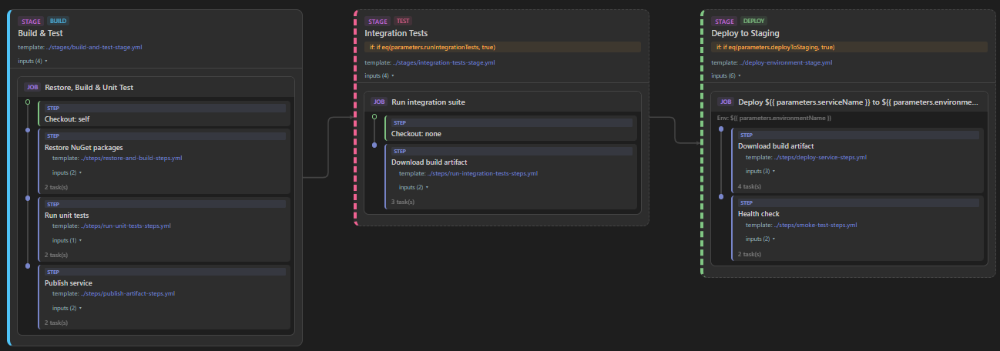
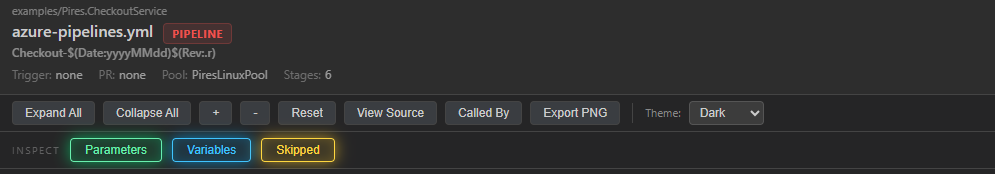
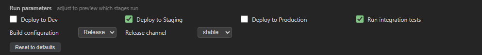
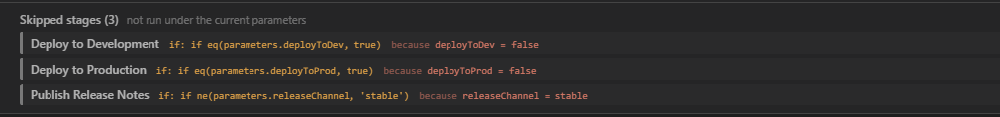
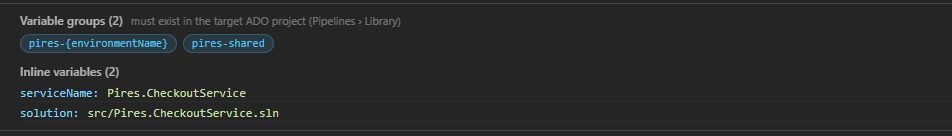
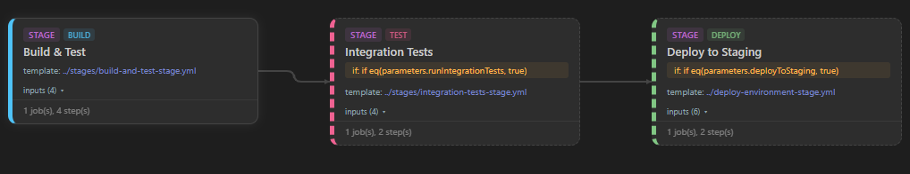
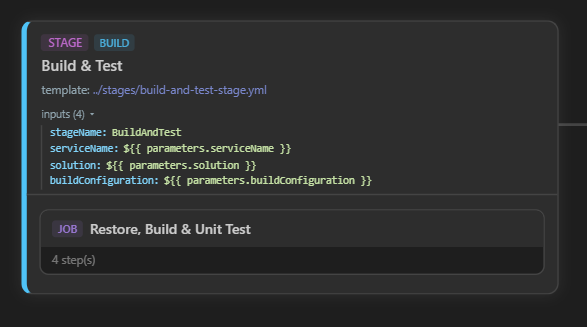
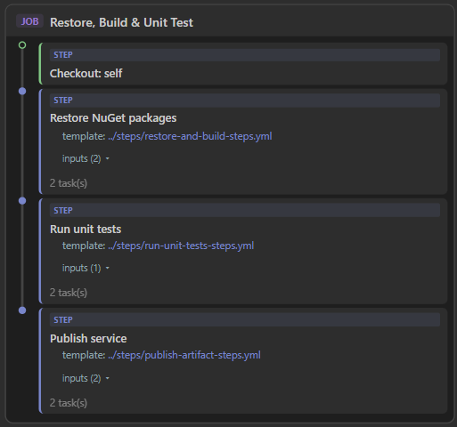
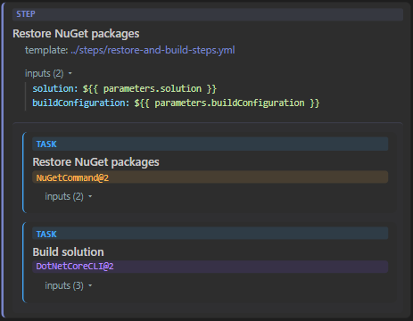
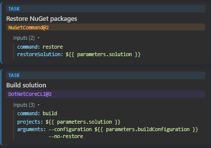

# Azure DevOps YAML Pipeline Viewer (with Template Support)

A VS Code extension that renders Azure DevOps YAML pipelines as interactive flowcharts with full recursive template resolution.

> Tired of scrolling through nested YAML and mentally stitching together templates spread across different repositories? This extension does it for you.

## The header

Every diagram opens with a compact header that tells you where you are at a glance.

- **Breadcrumb + file name** with a colored [type badge](#template-type-hierarchy) (Pipeline, Stage Template, and so on).
- **Meta line** — trigger, PR trigger, agent pool, and stage count.
- **Action toolbar** — Expand / Collapse All, zoom, Reset, **View Source**, **Called By**, **Export PNG**, and the theme selector.
- **Inspect row** — three panel toggles: **Parameters**, **Variables**, and **Skipped**. Each one lights up in its own color when it has something to show, and stays dimmed when it doesn't — so you can tell at a glance whether a pipeline has run parameters, variable groups, or skipped stages before you click. They start closed to keep the view clean.

## Features

### Interactive diagram
- Renders pipeline stages as a directed graph with orthogonal connectors and dependency arrows
- Expand and collapse stages to inspect jobs and individual steps
- Color-coded **stage types** (Build, Deploy, Validate, Detect, Sync, Test, NuGet, Database, etc.)
- Color-coded **step types** (VSBuild, NuGet, PowerShell, Bash, SonarQube, Cmd, etc.)
- Template type badges on headers (see [Template Type Hierarchy](#template-type-hierarchy) below)
- Conditional stages shown with dashed borders; skipped stages dimmed
- Skipped-stage dependency collapsing (arrows route through skipped stages to the real targets)
- `continueOnError` and condition expressions displayed at every level
- Deployment job lifecycle hooks (`preDeploy`, `deploy`, `routeTraffic`, `postRouteTraffic`, `on.failure`, `on.success`) parsed and shown as labeled steps

### Recursive template resolution
- Recursively resolves `template:` references for stages, jobs, and steps
- Full `extends:` support (resolves the extended template as the pipeline root)
- Cross-repository template support with automatic sibling-folder detection
- Workspace-recursive folder search (up to 5 levels deep, skipping `.git`, `node_modules`, etc.)
- Manual repository-to-folder mapping via `adoPipelineViewer.templateRepositoryMappings`
- Configurable max recursion depth (`adoPipelineViewer.maxTemplateDepth`, default 10)
- ADO conditional YAML preprocessing: handles `${{ if }}` blocks inside arrays (which standard YAML parsers reject) and deduplicates conditional keys automatically

### Interactive parameter picker
Adjust a pipeline's run parameters right in the diagram and instantly preview which stages will run — no re-opening, no guessing. Boolean parameters become checkboxes, choice parameters become dropdowns. `${{ if }}` conditions (`eq`, `ne`, `and`, `or`) are evaluated live as you change values. Reset to defaults any time; your choices are remembered per file.

### Skipped-stage panel
Stages that the current parameters gate out aren't silently dropped — they're listed with the exact condition and the parameter value that skipped them, so you always know *why* a stage isn't running. Toggle the panel from the toolbar.

### Variable groups & variables
See every **variable group** referenced anywhere in the resolved template tree — the Azure DevOps *Library* dependencies that must exist in the target project — alongside the pipeline's inline variables.

### Export & navigation
- **Export PNG** — save the diagram as an image straight from the toolbar
- Click any template reference (stage, job, or step) to navigate into its resolved template in a new panel
- Navigated template files are revealed in the Explorer sidebar
- Right-click any `.yml` / `.yaml` file in the Explorer, or use the editor title-bar button, to visualize it

### Toolbar
- **Expand All / Collapse All** — toggle all stages open or closed (also expands/collapses parameter and input toggles)
- **Zoom In (+) / Zoom Out (-) / Reset** — scale the flowchart from 30% to 200%
- **View Source** — jump straight to the YAML source file in the editor
- **Called By** — find pipelines across the workspace that reference the current file
- **Export PNG** — export the diagram as an image
- **Theme** — switch between System, Dark, and Light (persisted per panel)
- **Inspect row** — **Parameters**, **Variables**, and **Skipped** toggles, each color-lit when it has content and dimmed when empty; they start closed

---

## Template Type Hierarchy

When a file is visualized, the extension classifies it and displays a colored badge in the header. The classification follows a gradient from high-level orchestrators down to atomic step definitions:

| Badge &nbsp;&nbsp;&nbsp;&nbsp;&nbsp;&nbsp;&nbsp;&nbsp;&nbsp;&nbsp;&nbsp;&nbsp;&nbsp;&nbsp;&nbsp;&nbsp;&nbsp;&nbsp;&nbsp;&nbsp;&nbsp;&nbsp;&nbsp;&nbsp;&nbsp;&nbsp;&nbsp;&nbsp;&nbsp;&nbsp;&nbsp;&nbsp;&nbsp;&nbsp; | Classification | Detected When | Description |
|:------|:---------------|:--------------|:------------|
|  | Pipeline | File has `trigger`, `pool`, or uses `extends` | The entry-point YAML file that ADO executes directly |
|  | Pipeline Template | File defines multiple `stages:` and is referenced via `extends` | A multi-stage orchestrator template |
|  | Stage Template | File defines a single stage (or `stages:` with one entry) | A reusable stage definition |
|  | Job Template | File defines `jobs:` without wrapping stages | A reusable job definition |
|  | Step Template | File defines `steps:` without wrapping jobs or stages | A reusable step sequence |
|  | Resolved Task | Leaf node inside a resolved step template | A concrete ADO task (e.g., `PowerShell@2`, `VSBuild@1`) — not a file classification |

> The color gradient flows from **warm red** (high-level pipeline) through **pink** and **purple** to **light blue** (low-level steps), making it easy to identify at a glance where you are in the template hierarchy.

### Level by level

The viewer resolves and renders every level of the hierarchy, from the entry-point pipeline down to the concrete tasks inside deeply nested step templates.

**PIPELINE** — the entry-point orchestration and its stages

**STAGE** — stages and their dependency graph

**JOB** — jobs within an expanded stage

**STEP** — steps within a job, including template references

**TASK** — concrete tasks resolved inside step templates

---

## Stage Type Colors

Stages are automatically classified by name and display-name keywords, then color-coded:

| Color | Stage Type | Keyword Triggers |
|:------|:-----------|:-----------------|
|  | Build | `build`, `restore` |
|  | Deploy | `deploy`, `sign` |
|  | Validate | `validat`, `alert` |
|  | Detect | `detect`, `determine`, `extract` |
|  | Sync | `sync`, `drift`, `backfill` |
|  | Test | `test` |
|  | NuGet | `nuget` |
|  | Database | `database` |
|  | Template | Unresolved template reference |
|  | Generic | No keyword match (fallback) |

---

## Step Type Colors

Individual steps within jobs are color-coded by their left border:

| Color | Step Type | Description |
|:------|:----------|:------------|
|  | Template | A `template:` reference (clickable, navigable) |
|  | Task | An ADO `task:` (e.g., `VSBuild@1`, `NuGetCommand@2`) |
|  | Script / PowerShell / Bash / Cmd | Inline script steps |
|  | SonarQube | SonarQube analysis tasks |
|  | Checkout | `checkout: self` or `checkout: none` |

---

## Theming

Switch between **System**, **Dark**, and **Light** from the toolbar. The choice is persisted per panel.

---

## Try it

A self-contained example lives in [`examples/`](examples/) — a synthetic multi-repo service pipeline that extends a shared template library and fans out across environments, four template levels deep. Open `examples/Pires.CheckoutService/azure-pipelines.yml` and visualize it to explore the parameter picker, the skipped-stage panel, and template navigation. See [examples/README.md](examples/README.md) for a guided tour.

## Configuration

| Setting | Type | Default | Description |
|---|---|---|---|
| `adoPipelineViewer.templateRepositoryMappings` | `object` | `{}` | Map repository aliases to local folder paths. Example: `{ "templates": "C:/Git/MyTemplates" }` |
| `adoPipelineViewer.maxTemplateDepth` | `number` | `10` | Maximum depth for recursive template resolution |
| `adoPipelineViewer.theme` | `string` | `system` | Diagram color theme: `system`, `dark`, or `light` |

## Getting Started

1. Install the extension
2. Open any `.yml` or `.yaml` Azure DevOps pipeline file
3. Click the hierarchy icon in the editor title bar, or right-click the file in the Explorer and select **Visualize ADO Pipeline**
4. If your pipeline uses templates from another repository, clone that repo locally as a sibling folder — or configure the mapping in settings

## Good to know

- Runs **fully offline** on your local YAML files — no Azure DevOps connection, credentials, or API calls required.
- Template repositories are resolved from **local clones**: keep referenced repos as sibling folders (auto-detected) or map them in settings.

## Troubleshooting

**Templates not resolving:**
Ensure the template repository is cloned locally and either lives in a sibling folder to the pipeline's repo, or is explicitly mapped in `adoPipelineViewer.templateRepositoryMappings`.

**Extension not activating:**
The extension activates on `.yml` and `.yaml` files — open one first.

## License

[Apache License 2.0](LICENSE)
